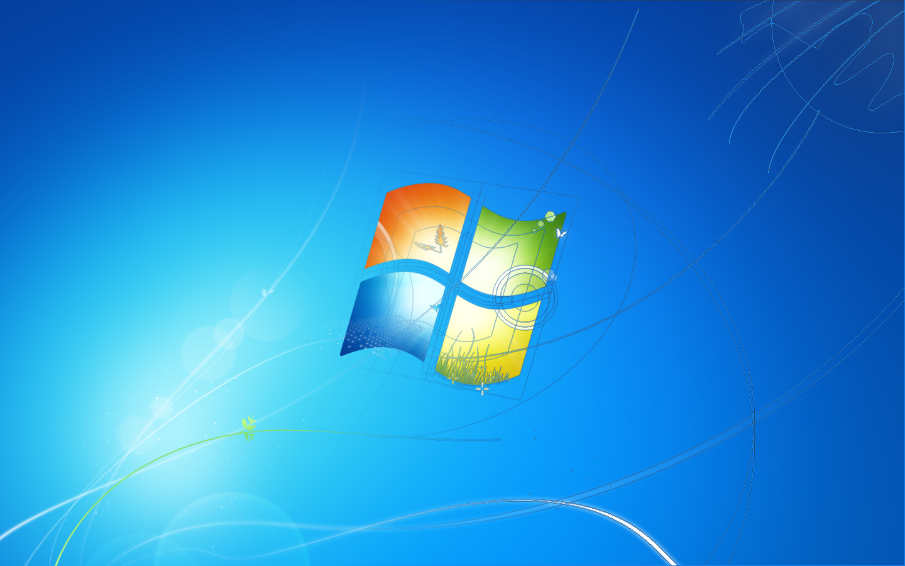

# Project_7: Windows 7 Assets Recreation

## Disclaimer
This project is a **non-commercial, artistic recreation** and is not affiliated with, authorized, or endorsed by Microsoft Corporation. All original designs, concepts, and trademarks (including the Windows logo) are the property of **Microsoft Corporation**. These assets are intended for personal use and nostalgic/preservation purposes only.

### About
This repository contains high-quality assets (PSD and exports) recreated from scratch in Adobe Photoshop 2019. The goal of this project is preservation and high-resolution restoration for nostalgic and educational purposes.

Right now the original wallpapers and their Starter version have been recreated from scratch. Logoless versions are also available. They can be found in `/Wallpapers`.

### Technical Details
- **Tools Used:** Adobe Photoshop 2019
- **Format**: Vector-based PSD
- **Resolutions (PNG)**: Original 2K (1920×1200) and 4K Version (3840×2400)
- **Color Space**: sRGB 16-bit
> [!NOTE]
> Many layers use Feather blurring of vector layers, which does not change with the resizing of elements.

### Credits
- **Original Concept**: Microsoft Corporation / Windows Design Team
- **Original Artists**: Chuck Anderson, Erik Attkisson
- **Recreation**: Max_34

### See Also
- [NoPattern Studio (Chuck Anderson)](https://nopattern.com)
- [Harmony on Windows Wallpaper Wiki](https://windowswallpaper.miraheze.org/wiki/Harmony)
- [Frutiger Aero Aesthetics on Aesthetics Wiki](https://aesthetics.fandom.com)
